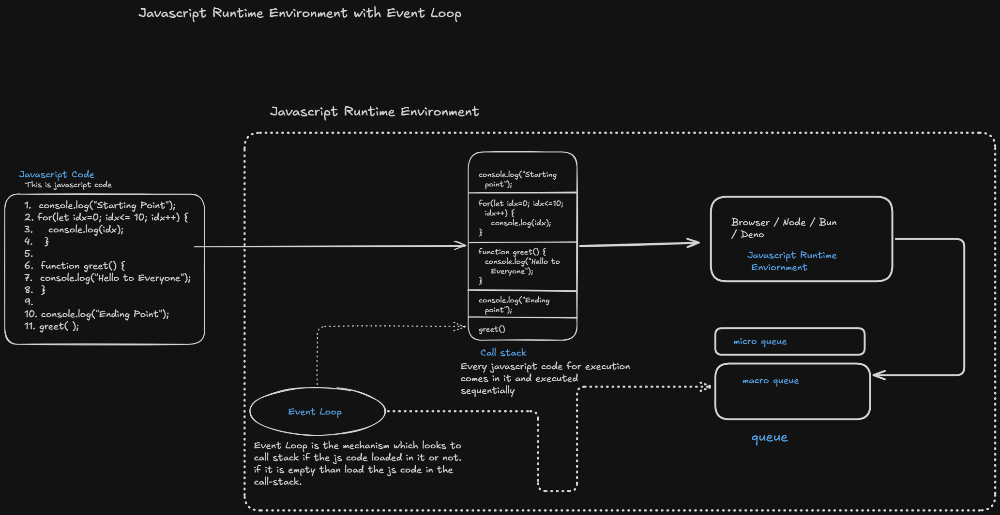

# Event Loop 
Event loop in our javascript runtime environment manage all this process 

## Javascript Runtime Environment
 

### Understanding Javascript Code Execution of  Synchronous and Asynchronous program with Event Loop
#### Js Code 
 - Javascript code was executed inside the call stack, in sequential manner code step by step 
```
console.log("Starting Point"); 

for(let idx = 1; idx <= 10; idx++>) {
    console.log(idx)
}

function greet()  {
    console.log("Hello To Everyone"); 
}

console.log("Ending Point");
greet(); 
```
#### Event Loop

- **Event Loop** is the mechanism which looks on the callstack is loaded or not if callstack empty than loaded with ready to execution code. 

- When the asynchronous code loaded in the Callstack and we know that javascript didn't have ability to perform asynchronous task so they transfer that code into Javascript runtime environment 

### Javascript Runtime Environment  
- Javascript runtime environment provides language more features with core features of it, we have different type of js runtime environment browser, nodejs, bun, and denojs etc. 
- Event Loop send asynchronous code into runtime environment which have capability to perform network calls over the internet, writing/reading file operations, timer function    
- This environment send this asynchronous code send to queues  

### Queues 
- This queues are hold the asynchronous code for waiting time upto the callstack clear than event-loop will loaded this code into callstack 
- This queues are also two types first is **micro-task queue** and **macro-task queue**. 
- **micro-task queue** is for high priority asynchronous code this queue code loaded first in call-stack. 
- **macro-task queue** is for low priority asynchronous code this is regular queue which loaded asynchronous code loaded not that high priority operation in call-stack. 

`Here to understand this Asynchronous code always executed after Synchronous code.`